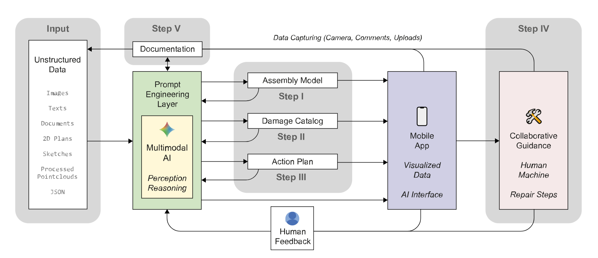
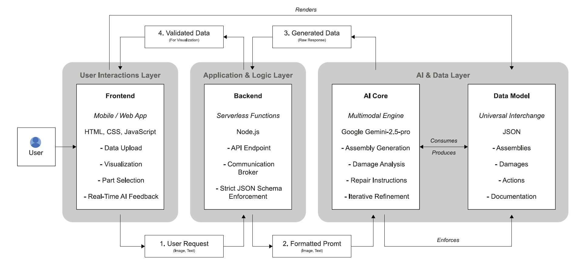

# FSTA – From Structure To Action  
Machine Reasoning and the Logics of Repair

*A Web Framework for AI-Assisted Repair Workflows*  
by **Tizian Rein**, 2025  

Supervised by Prof. Dr. Kathrin Dörfler
& Begüm Saral  
Technical University of Munich · Chair of Digital Fabrication · https://github.com/augmentedfabricationlab

---

## 🧩 Overview

FSTA is a browser-based research prototype that structures **repair as a digital, data-rich process**.  
It implements the workflow developed in the master thesis *Machine Reasoning and the Logics of Repair* and runs fully client-side, communicating through a serverless API layer hosted on **Vercel** (using Google Gemini 2.5 Pro Vision models).

No installation or cloning is required — simply open the deployed web app and follow the five steps of the repair process.

---

## 🧱 System Concept



The framework divides repair into **five structured steps**:

1. **Generate Assembly**  
   Create a parametric 3D model of an object (cuboid-based) from text or images.  
   Output → `assembly.json`

2. **Catalog Damages**  
   Compare the ideal assembly with real-world evidence.  
   Upload photos, PDFs, or notes to detect and annotate defects.  
   Output → `damages.json`

3. **Plan Actions**  
   Combine assemblies and damages to produce a step-by-step repair plan.  
   Output → `plan.json` (directed action graph)

4. **Guide Repair**  
   Follow the generated plan interactively. The embedded agent answers on-site repair questions.  
   Output → `record.json`

5. **Review & Document**  
   Log performed steps, attach photos, and export the complete intervention record.  
   Input → `record.json`

---

## 🧠 AI Agents

Each phase is assisted by a dedicated reasoning agent:

| Agent | Function |
|-------|-----------|
| **H.A.N.S.** 🌟| Generates assemblies |
| **M.A.G.D.A.** 🔎| Detects and classifies damages |
| **R.O.L.F.** 🔥| Plans and sequences repair actions |
| **H.E.L.G.A.** 🎭| Guides repair interactively |
| **S.I.G.N.A.** 💾| Compiles the final documentation |

All reasoning is performed via the Vercel serverless API connecting to **Gemini 2.5 Pro Vision**.  
The frontend never exposes the API key to users.

---

## 🔮 Repair Philosophies (The Ten Archetypes of Repair)

FSTA structures repair not as a single solution but as a **design space of competing logics**.  
Each “Brain” represents a different way of reasoning about intervention — technical, cultural, or conceptual.  
These archetypes can be selected to shape the generated repair plan or combined to explore hybrid strategies.

| Brain | Orientation | Description |
|--------|--------------|-------------|
| 🧹 **The Janitor’s Cookbook** | Pragmatic | Fast, cheap, robust. Function over aesthetics. Repair as survival logic. |
| ⏳ **The Long-Term Thinker** | Systemic | Inspired by Stewart Brand’s *Shearing Layers*. Focuses on modularity, reversibility, and preparation for future repairs. |
| 🚲 **The Readymade Brain** | Conceptual | Uses existing objects or materials creatively (after Duchamp). Repair as clever reappropriation. |
| 🔪 **The Anarchitect** | Subversive | Inspired by Gordon Matta-Clark. Cutting away and exposing hidden systems; questioning order. |
| 🕸️ **The Purist** | Ethical | Following John Ruskin’s idea of honesty and authenticity. Intervene only when necessary, leave traces visible. |
| 🛠️ **The Gentle Craftsman** | Traditional | Rooted in SPAB’s minimal intervention. Uses traditional skills and reversible methods. |
| ✨ **The Jeweler of Joints** | Artisanal | Following Carlo Scarpa. The joint becomes a crafted, visible dialogue between old and new. |
| 🏙️ **The Urbanist** | Societal | Inspired by Jane Jacobs. Repair as civic act, strengthening community and everyday use. |
| 🔬 **The Preservation Scientist** | Technical | Guided by ICOMOS principles. Based on research, risk assessment, and material science. |
| 🏰 **The Stylistic Idealist** | Aesthetic | Following Viollet-le-Duc. Aims for stylistic unity and perfection, sometimes reconstructing beyond authenticity. |

Each logic produces **distinct action graphs** and **different physical results** from the same input.  
This plurality turns FSTA into a **comparative reasoning tool**, allowing designers, conservators, and craftspeople to negotiate between competing values — authenticity, economy, performance, ecology, or aesthetics.

---

## ⚙️ Technologies



| Layer | Implementation |
|-------|----------------|
| Frontend | HTML 5 · CSS 3 · JavaScript ES6 modules |
| 3D Rendering | Three.js |
| Graph Visualization | D3.js |
| Backend | Serverless Node.js functions (Vercel) |
| AI Model | Google Gemini 2.5 Pro Vision |
| Data Format | JSON (assembly, damages, plan, record) |

---

## 📁 Project Structure

```
/
├── index.html                   # Entry page – navigation to all modules
├── generate-assembly.html    # Step 1 interface
├── catalog-damages.html      # Step 2 interface
├── plan-actions.html         # Step 3 interface
├── guide-repair.html         # Step 4 + 5 interface
├── /examples/                    # Sample JSON datasets
├── *.js                          # Logic for each step
├── README.md                     # Documentation
├── LICENSE                       # Open-source license
└── .github/                      # Issue and PR templates
```

---

## 🚀 How to Use

1. Open the deployed URL  
   → <a href="https://fsta-ten.vercel.app/" target="_blank" rel="noopener noreferrer">**fsta-ten.vercel.app**</a>


2. Choose a workflow step:
   - **Generate Assembly** → model your object  
   - **Catalog Damages** → upload photos, mark issues  
   - **Plan Actions** → generate repair plan  
   - **Guide Repair** → execute and ask

3. Export or download your JSON files at any time.  
   They can be re-imported into the next phase.

4. All computation happens through the serverless API.  
   Users never need an API key.

---

## 📄 Data Formats

### Assembly (`assembly.json`)
```json
{
  "objectName": "chair",
  "parts": [
    {
      "id": "leg_front_left",
      "origin": {"x":0,"y":0,"z":0},
      "dimensions": {"width":0.05,"height":0.45,"depth":0.05},
      "connections": ["seat_panel"]
    }
  ]
}
```

### Damages (`damages.json`)
```json
{
  "objectName": "chair",
  "damages": [
    {
      "id": "damage_01",
      "part_id": "leg_front_left",
      "type": "Crack",
      "description": "Vertical crack along inner face",
      "severity": "major",
      "confidence": 0.87
    }
  ]
}
```

### Plan (`plan.json`)
```json
{
  "objectName": "chair",
  "actions": [
    {"id":"a01","description":"Secure work area","dependsOn":[]},
    {"id":"a02","description":"Inject crack adhesive","dependsOn":["a01"]}
  ]
}
```

---

## 🧭 Philosophy

FSTA is grounded in the thesis **FROM STRUCTURE TO ACTION:** *Machine Reasoning and the Logics of Repair*.  
It explores how digital systems and multimodal AI can structure repair as a design act — not merely maintenance but a creative continuation of the built environment.

---

## 🧰 Developer Notes

- The entire app runs **client-side** with only minimal API calls.  
- Updates can be deployed instantly via **Vercel**.  
- Keep the `/examples` folder up to date with valid JSON samples to demonstrate the workflow.  
- All Gemini prompts are defined inside the corresponding `*.js` files under clear system role descriptions.

---

## ⚠️ Disclaimer

- Do **not** upload sensitive or copyrighted material.  
- AI results are suggestions — always verify with qualified expertise before applying in practice.  
- API usage may incur cost.

---

## 📜 License

This project is released under the **MIT License**.  
See the `LICENSE` file for details.

---

## 🧩 Citation

If you reference this repository in research or teaching:

> Rein, Tizian (2025). *From Structure To Action: Machine Reasoning and the Logics of Repair.*  
> Technical University of Munich, Chair of Digital Fabrication.

---

## 💬 Contact

**Tizian Rein**  
📧 mail@tizianrein.de    
🔗 [https://github.com/tizianrein/fsta](https://github.com/tizianrein/fsta)
